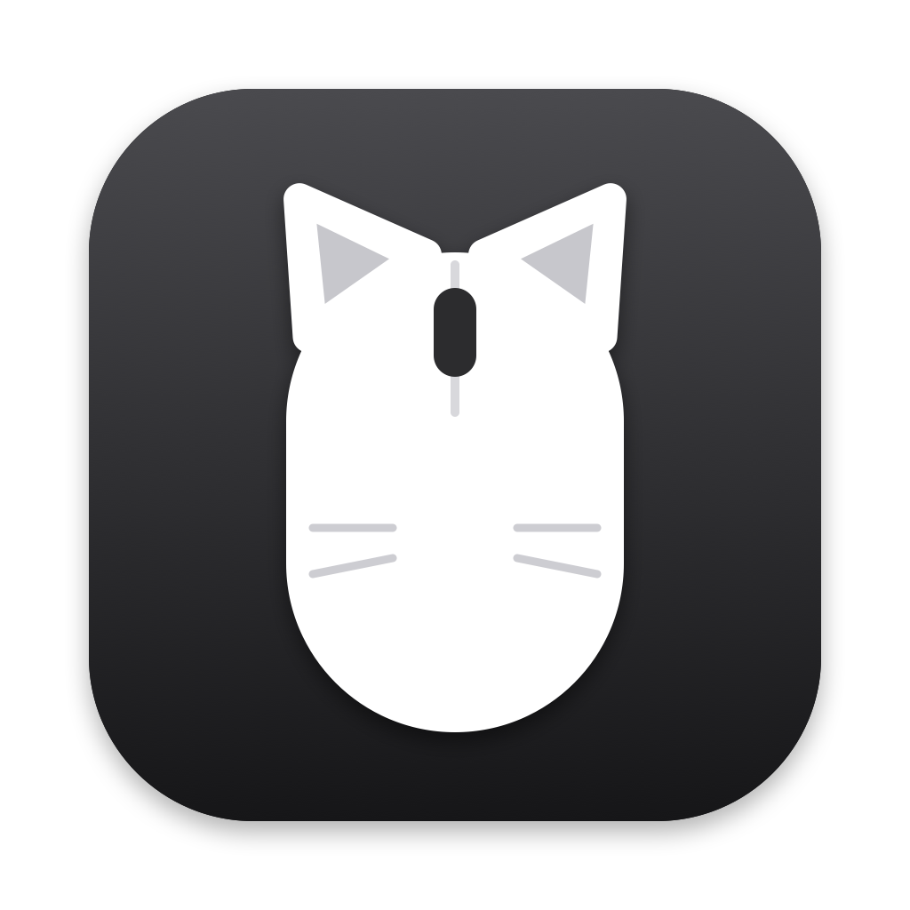

<p align="center"></p>

<h1 align="center">Meowse</h1>

<p align="center">Smooth scrolling for mouse wheels, plus Keep Awake and Wiggle Cursor, in a menu bar app that uses no CPU when idle.</p>

<p align="center"><a href="https://meowse.app">meowse.app</a> · <a href="https://github.com/salvcy/meowse/releases/latest/download/Meowse.zip">Download</a> · <a href="https://meowse.app/changelog">Changelog</a></p>

## Features

- **Smooth scrolling** for any scroll wheel, with adjustable scroll distance and smoothness. Trackpads and the Magic Mouse are left alone.
- **Reverse direction**, vertically and horizontally, independent of the trackpad setting.
- **Hold-to-modify hotkeys**: hold a modifier key or mouse button while scrolling to scroll faster, scroll horizontally, or turn smoothing off.
- **Simulated trackpad momentum**, so apps rubber-band and treat the glide as a fling.
- **Keep Awake** for a set time or until turned off, optionally letting the display sleep.
- **Wiggle Cursor** to stay active in chat apps while you're away from the keyboard.
- **In-app updates**, verified against the developer's code signature.

## Requirements

macOS 14 Sonoma or later, on Apple silicon or Intel.

## Installation

1. Download `Meowse.zip` from the [latest release](https://github.com/salvcy/meowse/releases/latest) and move **Meowse** to your Applications folder.
2. Open Meowse. When asked, turn on Meowse in **System Settings → Privacy & Security → Accessibility**. Meowse picks this up within a few seconds; no relaunch needed.

Settings → General shows whether Accessibility is allowed and the scroll engine is running.

## Updates

Meowse checks for a new release at most once a day, at a time macOS chooses to save energy, and you can also check from the menu or **Settings → Updates**. An update is installed only if its checksum matches and it's signed by the same developer as the installed copy.

## Privacy

Meowse collects nothing. Its only network request is the update check to GitHub, which you can turn off in Settings.

## Efficiency

Meowse is built to be invisible when it isn't working:

- **Zero idle cost.** No polling and no repeating timers. With the menu closed and nothing scrolling, it uses 0% CPU and has no wakeups, apart from the once-a-day update check, which you can turn off.
- **Under 9 MB of memory** at launch. The system allocator runs in its space-efficient mode, and Settings runs as its own process, so the memory it uses goes back to the system when its window closes. macOS leaves memory behind in every menu bar app when displays change; once that has doubled Meowse's launch memory, it starts over while the display is asleep.
- **One event tap**, configured for only the events your settings need, and absent entirely when nothing is enabled. It never sees your keystrokes; modifier hotkeys are read from the scroll event itself.
- **A dedicated scroll thread** with no locks or allocations on the event path, so a busy app never delays your scrolling.
- **Fewer events per glide.** A glide moves in whole points, the smallest step a scroll event can carry, so every event moves the page. On a 120 Hz display a wheel notch takes 42% fewer events than one per frame, and the glide still lands on its exact distance.
- **Frame-rate independent.** Glides feel the same at 60, 120 and 144 Hz, even when one moves to a display with a different refresh rate, and run at your display's full refresh rate.
- **System-enforced Keep Awake.** Timed sessions end on schedule even if Meowse quits.

## Building from source

```bash
git clone https://github.com/salvcy/meowse.git
cd meowse
swift test
scripts/install.sh    # builds, moves Meowse.app into /Applications and launches it
```

Building needs Xcode 15 or later. `scripts/build.sh` signs with your Apple Development certificate if you have one; otherwise the build is ad-hoc signed and macOS asks for Accessibility access again after each rebuild. See [CONTRIBUTING.md](CONTRIBUTING.md) for the project's rules and scripts.

## License

Meowse is licensed under [Creative Commons Attribution-NonCommercial 4.0](LICENSE) (CC BY-NC 4.0). You're free to use, modify, fork and share it for non-commercial purposes, as long as you credit "Meowse by salvcy" with a link to this repository and indicate any changes. Commercial use is not permitted.
